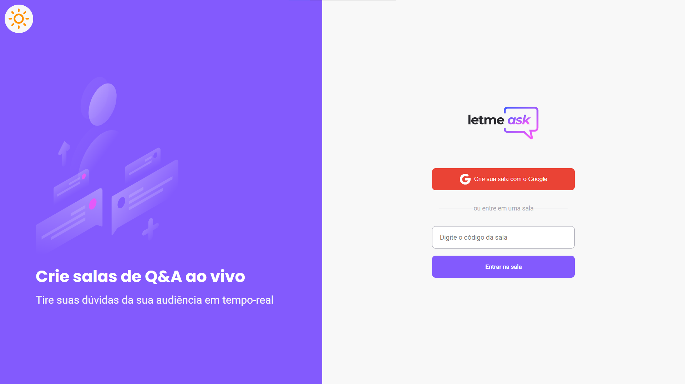
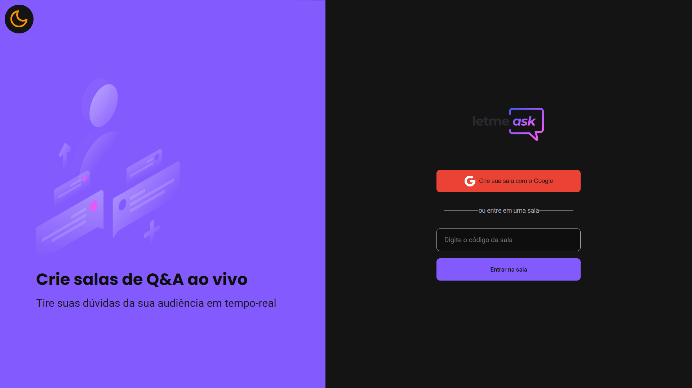

<p align="center">
  
</p>
<h1>🔅 Modo Claro 🔅</h1>
<p align="center">
    
</p>
<h1>🌙 Modo Noturno 🌙</h1>
<p align="center">
    
</p>

<br>

## 💪 Upgrades
 Nesse projeto eu implementei:
  - Escolha de Temas (Claro, Noturno)
  - Adicionei Toast no cadastro de contas, o toast também aparecerar quando a Sala for fechada pelo ADMIN.
  - Agora temos um MODAL, ele é usado quando o ADMIN tenta fechar uma sala, e quando ele tenta apagar uma pergunta.
  - Também criei uma HIC que estipula a autorização, para entrar na nota "/admin/rooms/:id"

## 🧪 Tecnologias

Esse projeto foi desenvolvido com as seguintes tecnologias:

- [React](https://reactjs.org)
- [Firebase](https://firebase.google.com/)
- [TypeScript](https://www.typescriptlang.org/)

## 🚀 Como executar

Clone o projeto e acesse a pasta do mesmo.

```bash
$ git clone https://github.com/weickfer/letmeask-upgraded
$ cd letmeask-upgraded
```

Para iniciá-lo, siga os passos abaixo:
```bash
# Instalar as dependências
$ yarn

# Iniciar o projeto
$ yarn start
```
O app estará disponível no seu browser pelo endereço http://localhost:3000.

Lembrando que será necessário criar uma conta no [Firebase](https://firebase.google.com/) e um projeto para disponibilizar um Realtime Database.

## 💻 Projeto

Letmeask é perfeito para criadores de conteúdos poderem criar salas de Q&A com o seu público, de uma forma muito organizada e democrática. 

Este é um projeto desenvolvido durante a **[Next Level Week Together](https://nextlevelweek.com/)**, apresentada dos dias 20 a 27 de Junho de 2021.


## 🔖 Layout

Você pode visualizar o layout do projeto através do link abaixo:

- [Layout Web](https://www.figma.com/file/u0BQK8rCf2KgzcukdRRCWh/Letmeask/duplicate) 

Lembrando que você precisa ter uma conta no [Figma](http://figma.com/).

## 📝 License

Esse projeto está sob a licença MIT. Veja o arquivo [LICENSE](LICENSE.md) para mais detalhes.

---